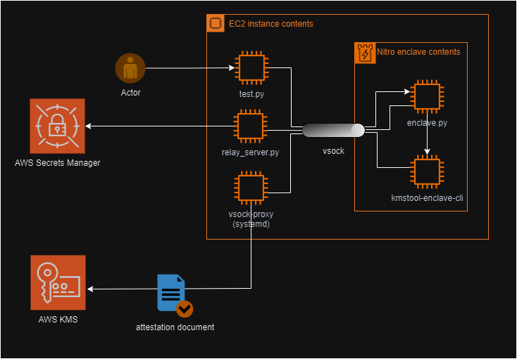

<h1 align="center">Nitro Enclave + KMS lock out</h1>
<p align="center">
  
</p>

## Overview

This project demonstrates a powerful security paradigm: enabling a specific enclave to exclusively possess decryption capabilities using a designated KMS (Key Management Service) key. The key aspect of this demonstration is the intentional exclusion of root user access to the decryption process.

### Key Objectives

Exclusive Decryption by Enclave: Illustrate how an enclave can be the only entity capable of decrypting a secret, leveraging a specified KMS key.
Root User Restriction: Showcase the process of restricting even the root user from accessing the decrypted content, thereby enhancing the security model.

### End Goal

The culmination of this demo is a practical and compelling demonstration where the enclave successfully decrypts a secret using the KMS key. This process uniquely occurs without granting decryption capabilities to the root user, thereby emphasizing the enclave's exclusive access and operation.

As an insightful exploration into advanced security mechanisms, the demo showcases how controlled access to encrypted data can be effectively implemented in a cloud environment.

## Tutorial steps
### (1) Launch EC2 instance
Make sure you are in the "default" us-east-1 / Virginia AWS region (otherwise code needs updating). The EC2 instance can be launched by preferred choice of 2 options: CLI or AWS Console. \
\
Launching via CLI

```
aws ec2 run-instances \
--image-id <LATEST_AMAZON_LINUX_AMI> \
--count 1 \
--instance-type m5.xlarge \
--key-name "<YOUR_KEY_NAME_FOR_SSH_ACCESS>" \
--subnet-id <REQUIRED_SUBNET_ID> \
--associate-public-ip-address \
--enclave-options 'Enabled=true'
```
Note: make sure SSH access is added to the security group corresponding to the EC2 instance

Launching via AWS Console
  - On AWS dashboard, navigate to service: EC2
  - Click on "Launch instance"
  - Provide a name for the instance
  - Latest Amazon linux AMI should be auto-selected, if not please select
  - Architecture 64-bit (x86) should be auto-selected, if not please select
  - For instance type, click to open up drop-down, search for m5.xlarge and select
  - At key-pair login (for SSH), add or create a new key pair for SSH access
  - Under network settings, "Create a new security group" should be auto-selected if not please select
  - Under network settings, "Allow SSH from" should be auto-selected, if not please select, change "Anywhere" to "My IP" \
    (Changing "Anywhere" to "MyIP" here satisfies the step (2) which produces the same changes)
  - Click on "Advanced settings" to open up the section, scroll down to "Nitro Enclave" and select "Enable"
  - Click on "Launch instance"

### (2) Edit security group rules to allow SSH

For SSH access to our newly launched ec2 instance, an inbound rule must be added to the corresponding security group. \
_Note:This step can be skipped if ec2 was launched via AWS console and SSH access was set to "MyIP" under Network settings_
- On AWS dashboard, Navigate to service: EC2
- Click on "instances" in the side-bar on the left
- Click to select the previously launched instance, click on "Security" tab on the panel below
- Under "Security groups" label, click on the security group link (e.g sg-a1b2c3...)
- Click on "Edit Inbound rules" on the panel below
If there are no rules:
- Click on "Add rule", select "SSH" for Type, select "My IP" for Source and save
If there is a rule:
- Update Type to "SSH", Source to "My IP" and save

### (3) Transfer app files to ec2 instance
Note: Steps below are to be performed on the remote machine.

 - SSH into your ec2 instance
```
ssh ec2-user@<PUBLIC_IP_ADDRESS_OF_EC2_INSTANCE>
```
 - Install project dependencies
```
sudo yum install git docker aws-nitro-enclaves-cli-devel aws-nitro-enclaves-cli gcc pip python3-devel -y
```
 - Download current project files to ec2 instance
```
git clone https://github.com/sebarmled/Nitro-Enclave-Demo.git
```

### (4) Setup EC2 instance

 - Add user permissions
```
sudo usermod -aG ne ec2-user
sudo usermod -aG docker ec2-user
```
 - Enable services
```
sudo systemctl enable --now docker
sudo systemctl enable --now nitro-enclaves-allocator.service
sudo systemctl enable --now nitro-enclaves-vsock-proxy.service
```
 - Reboot for changes to take effect
```
sudo reboot
```
### (5) Setup app requirements
 - Navigate to "Nitro-Enclave-Demo" directory and install dependencies
```
cd Nitro-Enclave-Demo
pip install -r ./enclave/requirements.txt
```
 - Build KMS tool \
   This script builds a CLI tool provided by AWS, which can be found at https://github.com/aws/aws-nitro-enclaves-sdk-c.
   With built-in support for KMS attestation and cryptographic operations, the tool is bundled into the enclave application and leveraged for attestated decryption of encrypted secrets.
```
chmod +x ./build_kms_tool.sh
./build_kms_tool.sh
```
 - Define environment variables \
   These variables would be used in the enclave and relay server accordingly
```
echo -e "\nexport REGION=us-east-1\nexport SECRET=secretlock" >> ~/.bashrc
source ~/.bashrc
```

### (6) KMS Key and IAM policy creation
 - Create KMS key for encryption & decryption purposes:
     - On AWS dashboard, navigate to service: Key Management Service (KMS)
     - Click on "Customer managed keys" in the side-bar on the left
     - Click on "Create key"
     - "Symmetric" should be auto-selected in key type, if not please select.
     - "Encrypt and Decrypt" should also be auto-selected if not please select, click "Next"
     - Provide an alias for the key (e.g lockout-encdec)
     - Provide description for the key ​(e.g Key used for encryption and decryption of secrets)
     - Select your account in key administrators, Click "Next"
     - Select your account in key usage permissions, Click "Next"​
     - Click "Finish"
 - Create IAM policy to allow encryption & secret fetch
     - On AWS dashboard, navigate to service: IAM
     - Click on "Policies" in the side-bar on the left, and click "Create policy"​
     - Click on "JSON" to switch the policy editor to JSON view
     - Add the following policy
       
       ```
       {
           "Version":"2012-10-17",
           "Statement": [
               {
                   "Sid": "Statement1",
                   "Effect": "Allow",
                   "Action": [
                       "kms:Encrypt",
                       "secretsmanager:CreateSecret",
                       "secretsmanager:GetSecretValue"
                       ],
                   "Resource": [
                       "*"
                       ]
               }
           ]
       }
       ```
     - Click "Next"
     - Provide a policy name (e.g Lockout-kms-policy)
     - Click "Create policy"
  
### (7) Encrypted secret & IAM role creation
 - Create an IAM role with previously created policy
     - On AWS dashboard, navigate to service: IAM
     - Click on "Roles" in the side-bar on the left, then click "Create Role"
     - "AWS Service" selected by default should be selected by default, if not please select
     - Select "EC2" for use case, then click "Next"
     - Search for the previously created policy in step (6) then tick the box, click "Next"
     - Provide role name (e.g Lockout-test-role), click "Create role"
 - Attach the newly created IAM role to the ec2 instance
     - On the AWS dashboard, navigate to service: EC2
     - Click "instances" in the side-bar on the left
     - Select the previously launched ec2 instance
     - Click Actions -> Security -> Modify IAM role
     - Select the preiviously created IAM role, then click "Update IAM role"
 - Create encrypted key via script
     - On ec2 instance, run the file `create_key.py` with KMS ARN & secret name as parameters
     - For the kms_arn field below, got into KMS in the AWS console, and fetch the arn of the KMS key created in step 6
     - For the secret_name below, choose any text of your choice
       
       Format:
        ```
        python3 create_key.py <kms_arn> <secret_name>
        ```       
       Example:
        ```
        python create_key.py arn:aws:kms:eu-central-1:1234:key/a1b2c2-d4e5f6-abcdef supersecretkey
        ```

### (8) Enclave setup
 - Build docker image
```
docker build --build-arg REGION=$REGION  --build-arg SECRET=$SECRET -t lockout-enclave .
```
 - Build enclave image file (EIF)
```
nitro-cli build-enclave --docker-uri lockout-enclave:latest --output-file lockout.eif
```
 - Update enclave resource allocation
```
sudo nano /etc/nitro_enclaves/allocator.yaml
```
 - Update "memory_mib" to 2560
 - (To exit) press "Ctrl + X", "Y", then "Enter"
 - Restart the service
```
sudo systemctl restart nitro-enclaves-allocator.service
```
 - Run enclave (from where the nitro image file "lockout.eif" is located)
```
nitro-cli run-enclave --enclave-cid 20 --eif-path ./lockout.eif --cpu-count 2 --memory 2560 --enclave-name lockout
```
 - (Optional) Confirm enclave is running
```
nitro-cli describe-enclaves
```
### (9) Lock-out root user & limit decryption to enclave
 - Get ARN of IAM role
     - On AWS dashboard, navigate to service: IAM
     - Click on "Roles" in the side-bar on the left
     - Search for the role previously created, Click on the role
     - Copy the value of "ARN"
 - Get Enclave PCR0 value
     - On the ec2 instance terminal, run:
        ```
        nitro-cli describe-enclaves
        ```
     - Copy the corresponding value of the key "PCR0", example output below
       ```
       {
          "Measurements": {
            "HashAlgorithm": "Sha384 { ... }",
            "PCR0": "d425a8dddca64416b9bd2b1a352978198ee2cf2adfea7b899c3b91b441988ce40c867ed6f6234b8de88ec254d40c4bca",
            "PCR1": "52b919754e1643f4027eeee8ec39cc4a2cb931723de0c93ce5cc8d407467dc4302e86490c01c0d755acfe10dbf657546",
            "PCR2": "32e5a1eeac8046d3389f2519c7d965f263584b131953b7b3ae54c320194084675bf306a6ef87cc8bccd34549433b396c"
          }
        }
       ```
 - Update KMS policy
     - On AWS dashboard, navgate to service: Key Management Service (KMS)
     - Click on "Customer managed keys" in the side-bar on the left
     - Click "JSON' to switch the policy editor to JSON view
     - Add the following rule in the statement list, fill in the ARN and PCR0 values at respective locations
       ```
       {
           "Sid":"Enable decrypt from enclave",
           "Effect":"Allow",
           "Principal":{
                   "AWS":"<Insert IAM role ARN here>"
           },
           "Action":"kms:Decrypt",
           "Resource":"*",
           "Condition":{
               "StringEqualsIgnoreCase":{
                   "kms:RecipientAttestation:ImageSha384":"<Insert PCR0 value here>"
               }
           }
       }
       ```
     - Delete JSON block containing permissions for the root user \
       _This locks out the root user_
     - Delete the line "kms:Decrypt" from the JSON block for Key admministrators \
       _This ensures the enclave to be the sole existing resource with decryption capabilities_
  
### (10) Test the setup
Each command to be executed in a seperate terminal shell, inside the /Nitro-Enclave-Demo folder:
 - Run relay server \
   _This starts the relay server which helps enclave fetch secrets_
```
python3 relay_server.py
```
 - Run test script \
   _This sends a test transaction to enclave for signing bytes using the secret seed in Secret Manager decrypted by KMS key_
```
python3 test.py
```
 - Run user decryption test (Expects to output a permissions error) \
   _The permissions error returned hereby confirms that usage of the key from root account is disabled (hence, locked out)_


# Transaction signature flow
The following diagram illustrates the flow of operations in the execution of the test.

## Workflow
Process of the transaction is as belows:
 - Tx is sent from test.py to enclave via vsock
 - enclave.py requests relay_server.py to fetch credentials and encrypted seed
 - relay_server.py fetches credentials from AWS IMDS , encrypted seed from AWS secrets manager then relays back to enclave.py
 - enclave.py calls decrypt via kms_tool
 - kms_tool sends encrypted seed as ciphertext to AWS KMS via nitro-enclave-vsock-proxy-service on host ec2
 - KMS decrypts the encrypted seed and returns plaintext encrypted by public key of attestation document, also via nitro-enclave-vsock-proxy-service on host ec2
 - encrypted plaintext is decrypted once returned and is used by envclave.py to sign Tx
 - signed Tx is sent back to test.py via vsock

<p align="center">
  
</p>


